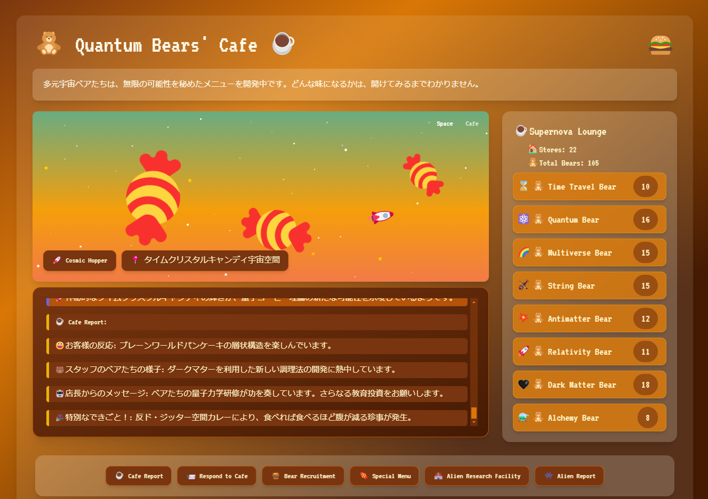
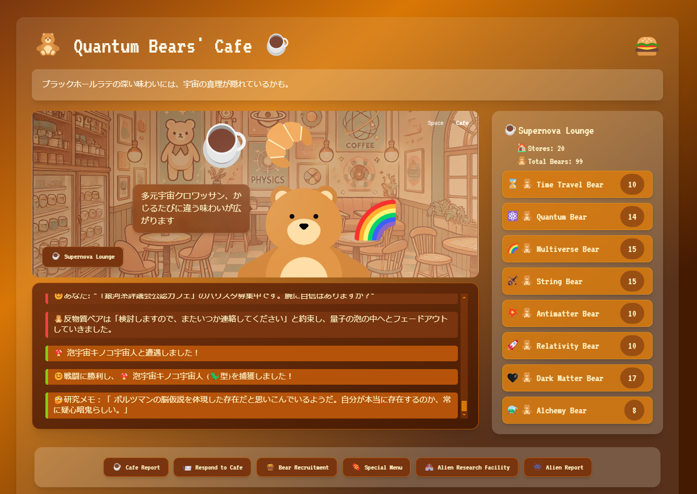
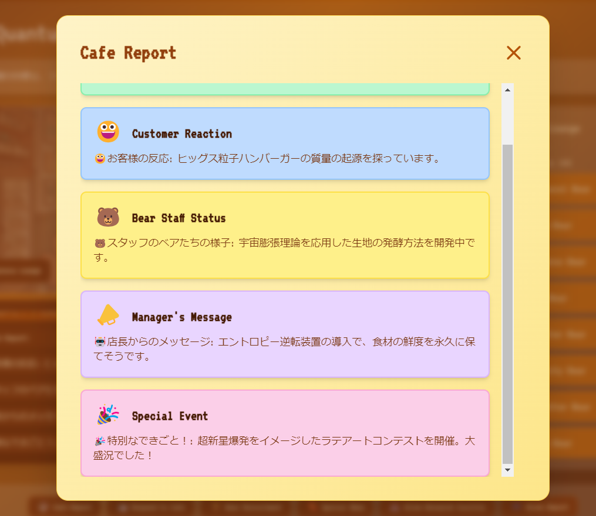
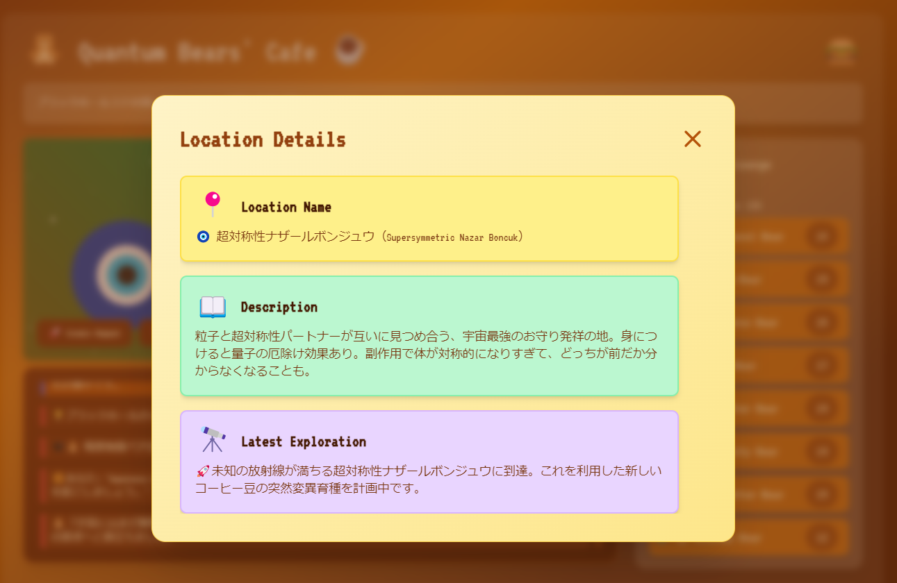

# 🧸Quantum Bears' Cafe☕: Galactic Defense Brewmasters

**量子もつれカプチーノで宇宙の神秘に触れる。スペシャルなあなたのカフェで紡ぐ、銀河の物語。**

*Unravel cosmic mysteries with quantum-entangled cappuccinos. Craft the galaxy's story in your extraordinary cafe.*

## ☕概要

🧸Quantum Bears' Cafe☕は、宇宙を舞台にしたユニークなアイドルゲームです。プレイヤーはカフェオーナーとして、特殊な能力を秘めた量子ベア、相対性ベア、超弦ベア、暗黒物質ベア、タイムトラベルベア、錬金術ベア、多元宇宙ベア、反物質ベアたちをバリスタとして雇い、さまざまな宇宙空間を旅しながら宇宙の謎を解き明かし、最終的には宇宙を守ることを目指します。

☕☕☕☕☕プレイはこちらから：[Quantum Bears' Cafe ゲームページ](https://230327tokiex.github.io/QuantumBearsCafe/)

## 🚀主要機能

- ヘッダー：ゲーム設定やカスタマイズオプションにアクセス
- フレーバーテキストエリア：ゲーム世界の雰囲気を伝えるテキストを表示
- グラフィックエリア：プレイヤーが旅するスペースシーンモード、経営するカフェのカフェシーンモードの切替
- イベントログエリア：ゲーム内で発生するさまざまなイベントを表示
- ベアリストエリア：雇用したベアの情報を表示
- アクションボタンエリア：最新のイベントログの確認など各種ゲーム機能へのアクセス

## 🧸ゲームプレイ方法

1. グラフィックエリアで宇宙空間を探索し、新しい場所を発見します。
2. イベントログエリアでゲーム内の出来事を確認します。
3. ベアリストエリアで新しいベアを雇用し、カフェを拡大します。
4. アクションボタンを使用して、カフェレポートの確認、ベアの採用、宇宙人との戦闘などを行います。
5. 特殊なメニューやアイテムを開発し、カフェの魅力を高めます。
6. 宇宙人研究所で捕獲した宇宙人のデータを分析し、宇宙の謎を解き明かします。
7. ハンバーガーメニューから、プレイヤー名、カフェ名、乗り物名のカスタマイズ、ゲームデータの削除、アチーブメントの確認ができます。

## 🍰実装済み機能

- 宇宙空間移動
- ベアリクルート
- 宇宙人研究所開設
- 宇宙人との戦闘
- アチーブメントシステムの導入

## 👾今後の予定

- レアアイテム、スペシャルメニュー関連の拡張
- 宇宙人との戦闘システムの拡張
- 宇宙人レポートの拡張
- カフェ交信システムの実装
- その他、ゲームプレイの深化と拡張

## 技術スタック

- React
- TypeScript
- Tailwind CSS
- styled-components

## ライセンス 

このプロジェクトは [MIT] のもとで公開されています。詳細は LICENSE ファイルをご覧ください。

## Acknowledgements

This project was developed with assistance from Claude AI, an AI technology by Anthropic.
© toki 2024

## 更新履歴

- v0.1.0-beta (2023-08-19): 初期ベータ版リリース
  - 基本的なゲームシステムの実装(ベアリクルート、カフェレポート、宇宙空間移動イベント、Space/cafeモード切替、宇宙人研究所開設、宇宙人戦闘、宇宙人レポート、アチーブメント、各種カスタマイズなど)

